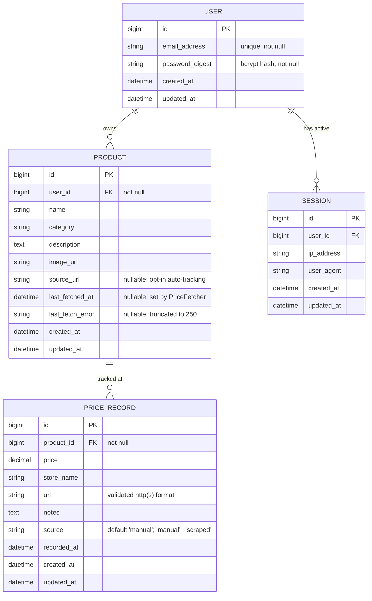
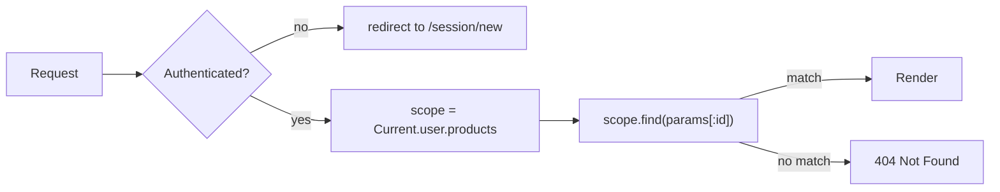
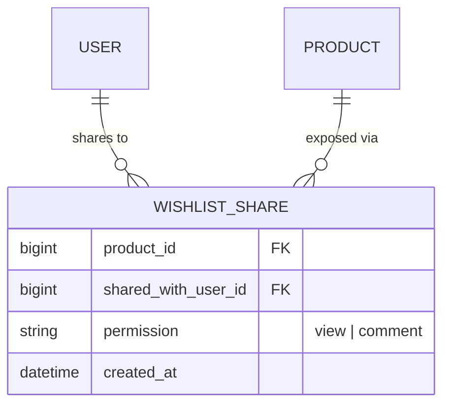

# Database & Entity-Relationship Reference

This document describes the PriceTracker database schema and relationships.
For the authoritative column list, see [`db/schema.rb`](../db/schema.rb).

---

## 1. Current schema (production)

The diagram below is a simplified view from early milestones. The live schema
also includes, among other things:

- **users** — OAuth fields (`provider`, `uid`, `name`, `avatar_url`); profile
  photos via **Active Storage** (`has_one_attached :avatar`)
- **products** — `target_price`, `auto_refresh`, `tags` (PostgreSQL array),
  `favorite`, `last_alerted_at`, stock fields, scrape timestamps/errors
- **folders** + **folder_products** — many-to-many product grouping
- **price_refresh_runs** — batch observability for scheduled/manual refresh
- **active_storage_*** — blobs and attachments for user avatars

### Entity-relationship diagram (core)



### Scraping fields (added in `AddScrapingFieldsToProductsAndPriceRecords`)

These columns are entirely additive and opt-in. A product with
`source_url IS NULL` behaves exactly as it did before this migration:
no automatic refresh, no "Fetch latest price" button. See
[scrapers.md](scrapers.md) for the full lifecycle.

| Column | Default | Set by |
|---|---|---|
| `products.source_url` | `NULL` | User, on the new-product form |
| `products.last_fetched_at` | `NULL` | `PriceFetcher.call` after a successful fetch |
| `products.last_fetch_error` | `NULL` | `PriceFetcher.call` when a `PriceScrapers::Error` is rescued |
| `price_records.source` | `"manual"` | `"manual"` for human-entered rows; `"scraped"` for rows created by `PriceFetcher` |

### `price_refresh_runs` (batch observability)

Added for scheduled/manual refresh reporting. One row per enqueued batch.

| Column | Purpose |
|---|---|
| `triggered_by` | `schedule`, `manual`, or `unknown` (from `X-Trigger-Source`) |
| `status` | `pending` → `running` → `completed` / `skipped_overlap` / `failed` |
| `total_products` | Scrapeable catalog size at run time |
| `catalog_with_url` | All products with any `source_url` (includes non-PDP rows) |
| `attempted`, `succeeded`, `failed` | Batch counters |
| `stale_remaining` | Scrapeable products still due after this batch |
| `duration_seconds` | Wall time for the batch |
| `failure_details` | JSON array of sample failures `{ product_id, name, source_url, host, user_email, error, category }` |
| `failure_summary` | JSON `{ total_failures, by_category[], by_host[], by_error[] }` — full counts for the run |
| `enqueued_at`, `started_at`, `finished_at` | Timestamps |

Poll API (admin token): `GET /admin/refresh_runs/:id`. The GitHub Actions workflow
writes the same data to the run **Summary** tab. See [scrapers.md § 4.1c](scrapers.md).

### Cardinality summary

| From → To | Cardinality | Meaning |
|---|---|---|
| User → Product | 1 ↔ many | A user owns any number of tracked products. |
| User → Session | 1 ↔ many | A user can be signed in on multiple devices/browsers. |
| Product → PriceRecord | 1 ↔ many | One product accumulates many observed prices over time. |

All "many" sides cascade-delete: deleting a user destroys their products and sessions; deleting a product destroys its price records.

---

## 2. Authorization model

Every product is **scoped to its owning user**. Controllers always query through `Current.user.products`, never `Product` directly. This means:

- A user listing products only sees their own.
- A user trying to access another user's product (`/products/:id`) gets a `404 Not Found` — not a `403`. This avoids leaking the existence of resources owned by other users.
- Price records inherit user scoping transitively through `product`. There is no `user_id` column on `price_records` because it's redundant — a price record's owner is implied by its product.



---

## 3. Validations

| Model | Field | Rule |
|---|---|---|
| User | `email_address` | normalized to lowercase + stripped, unique |
| User | `password` | required on create, bcrypt-hashed via `has_secure_password` |
| Product | `name` | presence required |
| Product | `category` | presence required |
| Product | `user_id` | implied by `belongs_to :user` (DB NOT NULL) |
| PriceRecord | `price` | presence + numericality, must be > 0 |
| PriceRecord | `store_name` | presence required |
| PriceRecord | `recorded_at` | presence; auto-filled with `Time.current` if blank |
| PriceRecord | `url` | optional; if present, must match `https?://...` |

---

## 4. Future schema ideas

Several items below were **planned early** and are now **shipped** (target
price, in-app/email alerts, comma-separated tags on products, user avatar via
Active Storage). This section lists ideas we have **not** built yet.

### 4.1 Purchased / archived state

A simple boolean toggle so users can mark items they've bought (or stopped tracking) and hide them from the active grid.

```ruby
add_column :products, :purchased_at, :datetime
# scope :active,    -> { where(purchased_at: nil) }
# scope :purchased, -> { where.not(purchased_at: nil) }
```

A nullable timestamp captures both "is it purchased?" and "when?" in one column — more flexible than a plain boolean.

### 4.2 Product image uploads (not user avatars)

Product thumbnails today come from scraped `image_url` or a manual URL field.
Uploading a custom product photo (Active Storage on `Product`) is still a future idea.

### 4.3 Shared wishlists

To let users share lists with others without giving up ownership, introduce a join model:



This keeps the strict per-owner authorization rule — sharing is opt-in metadata, not a change to ownership.

---

## 5. Anti-features (intentional non-changes)

A few things we explicitly **don't** plan to add, with reasoning:

| Idea | Why we're skipping |
|---|---|
| `user_id` on `price_records` | Redundant — derivable from `product.user_id`. Adds index churn and risk of inconsistency. |
| Roles / admins | MVP is single-tenant per user; no admin surface. |
| Soft-delete (`deleted_at`) on products | Not justified yet. Real deletes + cascading destroy is simpler and the data isn't business-critical. |
| Polymorphic price source | A `PriceRecord` is always tied to a `Product`. No need for polymorphism. |

---

## 6. How to update this doc

When you add or change a migration, update the relevant section above. Mermaid diagrams render natively on GitHub, so no extra tooling is needed — just edit the code blocks.
