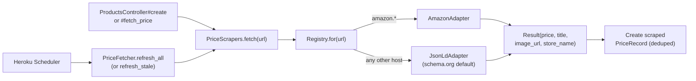

# Price Scrapers

This document describes how PriceTracker fetches prices from retailer
websites, how to add support for a new site, how the scheduler is configured
on Heroku, and what is known to work today.

---

## 1. Architecture at a glance



Three triggers, one core path:
- **B. Product creation** (synchronous, blocks the form submit)
- **A. Manual "Fetch latest price" button** (synchronous, blocks the click)
- **C. Heroku Scheduler** (off-process daily/hourly cron)

There is no Solid Queue, no worker dyno, and no `FetchPriceJob` — every
"trigger" calls into `PriceFetcher.call` directly. Failures are caught and
written to `product.last_fetch_error`, never propagated to the user.

---

## 2. The adapter contract

Every adapter inherits from `PriceScrapers::Base` and implements one method:

```ruby
def parse(doc, url)
  PriceScrapers::Result.new(
    price:      BigDecimal_or_nil,
    currency:   "USD",
    title:      String_or_nil,
    image_url:  String_or_nil,
    store_name: "Target",   # optional; Base falls back to host name
  )
end
```

`Base#fetch` handles HTTP, headers, error mapping, and helpers like
`#parse_price("$1,234.56") -> BigDecimal`. Subclasses only worry about
extracting fields from a `Nokogiri::HTML` document.

A `Result` with all-nil fields is *legal*: it represents "we could read the
page but found nothing useful." That just means no `PriceRecord` will be
created, but `last_fetched_at` still updates. The product page shows a
warning instead of crashing.

To raise a hard failure, throw one of:
- `PriceScrapers::TransientError` — try again next scheduler run (timeouts, 5xx)
- `PriceScrapers::PermanentError` — needs human attention (4xx, no recognizable shape)

Both are subclasses of `PriceScrapers::Error`, which the controllers and
`PriceFetcher` rescue.

---

## 3. Adding a new site

1. **Try the URL with the existing JSON-LD adapter first.** Most retailers
   already work because they emit schema.org Product data for SEO. Just add
   a product with the URL and click "Fetch latest price." If you get a real
   price, you're done — no code needed.

2. **If JSON-LD doesn't work**, write a site-specific adapter:

   ```ruby
   # app/services/price_scrapers/best_buy_adapter.rb
   module PriceScrapers
     class BestBuyAdapter < Base
       def parse(doc, _url)
         Result.new(
           price:     parse_price(doc.at_css(".priceView-customer-price span")&.text),
           title:     doc.at_css(".sku-title h1")&.text&.strip,
           image_url: doc.at_css(".primary-image")&.[]("src"),
           store_name: "Best Buy"
         )
       end
     end
   end
   ```

3. **Register it** in [`app/services/price_scrapers/registry.rb`][reg]:

   ```ruby
   ADAPTERS = [
     [ /(\A|\.)amazon\.[a-z.]+\z/,   AmazonAdapter ],
     [ /(\A|\.)bestbuy\.com\z/,      BestBuyAdapter ],
   ].freeze
   ```

4. **Add a fixture and test.** Save a real page snapshot to
   `test/fixtures/scrapers/best_buy.html` and write a test in
   `test/services/price_scrapers/best_buy_adapter_test.rb` that parses it
   without hitting the network.

[reg]: ../app/services/price_scrapers/registry.rb

---

## 4. Heroku Scheduler configuration (one-time, in dashboard)

The scheduler runs the same `PriceFetcher` code, just without a user
attached. There is **no commit** required to enable it; everything lives
in the Heroku dashboard.

1. **Provision the add-on** (free):

   ```bash
   heroku addons:create scheduler:standard --app smart-shoppinglist
   ```

   Or in the dashboard: **Resources → Add-ons → search "Heroku Scheduler" → Provision**.

2. **Open Scheduler**:

   ```bash
   heroku addons:open scheduler --app smart-shoppinglist
   ```

3. **Add a Job**:
   - **Schedule**: `Every day at 09:00 UTC` (or hourly if you want a richer demo)
   - **Run Command**: `bin/rails runner "PriceFetcher.refresh_all"`
   - **Dyno Size**: `Eco` (this is a temporary one-off dyno)

4. **Save**.

### When to switch from `refresh_all` to `refresh_stale`

- **Few products, low frequency (default):** `refresh_all` — re-checks every product on every run.
- **Many products, high frequency:** `refresh_stale` — only re-checks products whose `last_fetched_at` is older than 2 days, avoiding waste.

Change the command in the Scheduler dashboard; no code change needed.

### Cost

`Heroku Scheduler` is free. The one-off dyno it spawns counts against your
Eco dyno hours (1000/month shared). For 5 products refreshed daily:
~7.5 minutes of dyno-hours per month — negligible. Even hourly is ~3 hours
per month, well within budget. The total monthly bill stays at **$10**
(`Eco web $5 + Mini Postgres $5`).

---

## 5. Pricing dedup, idempotence, and what scrapers will not touch

`PriceFetcher.call(product)` is safe to invoke at any frequency:

- A new `PriceRecord(source: "scraped")` is written **only** when the
  fetched price differs from the last scraped record. Repeated identical
  prices update `last_fetched_at` but do not pollute price history.
- It **never mutates** `product.name`, `product.image_url`,
  `product.description`, or `product.category`. Those are populated only
  during product creation in [`ProductsController#create`][pc] and stay
  user-controlled afterwards.
- Manual price records (`source: "manual"`) are never deleted or modified.
- Products without a `source_url` are completely ignored — backwards-
  compatibility for any pre-existing manual-only products.

[pc]: ../app/controllers/products_controller.rb

---

## 6. Site support: what works today

This is a best-effort prediction; verify by trying a real URL and looking
at `product.last_fetch_error`.

### A — Generic adapter (`JsonLdAdapter`) is expected to work

Most large retailers publish schema.org `Product` JSON-LD because Google's
Rich Results require it. The same parser handles all of these.

| Site | Why it should work |
|---|---|
| Best Buy | Standard JSON-LD |
| Newegg | Standard JSON-LD |
| Apple Store | Standard JSON-LD |
| B&H Photo | Standard JSON-LD |
| Walmart (PDP) | Standard JSON-LD |
| Costco | Standard JSON-LD |
| Home Depot | Standard JSON-LD |
| Lowe's | Standard JSON-LD |
| Etsy | Standard JSON-LD |
| IKEA | Standard JSON-LD |
| Nike, Adidas | Standard JSON-LD |
| Lululemon | Salesforce Commerce default |
| Macy's, Nordstrom, REI | Standard JSON-LD |

### B — Has its own adapter

| Site | Adapter | Why custom |
|---|---|---|
| Amazon | `AmazonAdapter` | Inconsistent JSON-LD; uses `#corePriceDisplay_desktop_feature_div .a-offscreen` and similar fallbacks. Aggressive bot detection, but our usage volume is well below their thresholds. |

### C — Likely to need work

| Site | Issue |
|---|---|
| ZARA, H&M | Some pages render price asynchronously after the initial GET (no SSR for price). |
| Small DTC brands on bespoke stacks | Hit-or-miss; many are on Shopify and emit JSON-LD by default, but custom themes may strip it. |

### D — Not feasible without a different approach

These sites are **known blockers**. Hitting one of them is not a bug in our
scraper — it is a deliberate design decision by the retailer that no plain
HTTP client (Ruby, curl, Python `requests`, etc.) can defeat.

| Category | What it looks like | Why we cannot bypass it | Confirmed examples |
|---|---|---|---|
| **Cloudflare Bot Management** | First request returns HTTP 403 with response headers `cf-mitigated: challenge` and a `__cf_bm` cookie. The body is a JavaScript challenge page from `challenges.cloudflare.com`, not the real product. | The challenge requires executing JavaScript in a real browser to compute a token, then re-requesting with the resulting cookie. HTTParty does not run JavaScript, and TLS fingerprinting (JA3) flags Ruby clients regardless of headers. | Alo Yoga, Nordstrom, Sephora, ASOS |
| **Akamai Bot Manager (strict mode)** | HTTP 403 or an Akamai sensor-data challenge page; sometimes redirects to a `_abck` cookie set page. | Same root cause as Cloudflare: requires a full browser environment to execute the sensor JS. | Footlocker (some pages), some Nike releases |
| **PerimeterX / HUMAN Security (IP-reputation tier)** | HTTP 403 with a `_pxhd` (or `_px`) cookie set, sometimes accompanied by `RTSS` / `rtss1` headers. The body is either an empty PX challenge page or a generic `<html>403</html>`. **Crucially: this often returns success from a residential IP and 403 from a cloud IP** — it's not deterministic. | PX scores every request against an IP reputation database. Heroku / AWS / GCP IP ranges are pre-flagged as "datacenter, likely bot" and blocked even with a perfect User-Agent. There is no client-side workaround. | Free People, Urban Outfitters, Anthropologie (all on the URBN platform) |
| **Login / membership wall** | HTML loads, but price markup is replaced with "Sign in to see price." | Requires authenticated session cookies we don't have. | Costco (some categories) |
| **Variant required for price** | Page renders without a price; user must pick size/color first via JS. | Initial SSR HTML genuinely contains no price — there is nothing to scrape. | Some apparel PDPs |
| **Pure client-side rendering** | The HTML is essentially an empty `<div id="root">`; everything is fetched and rendered by React/Vue after page load. | Headless browser (Playwright) needed; out of scope on a single Heroku Eco dyno. | Some smaller DTC sites |
| **Target (CSR rollout, ~Apr 2026)** | Returns HTTP 200 with a complete-looking HTML page, but contains zero `application/ld+json` scripts. The Next.js `__NEXT_DATA__` blob explicitly carries `pageProps.isProductDetailServerSideRenderPriceEnabled: false`. The price is fetched after hydration via `redsky.target.com/redsky_aggregations/...`. | Target rolled this server-side-render-disable flag out globally just before Milestone 1; their HTML now contains no price field at all to scrape. Reverse-engineering the redsky GraphQL endpoint is feasible (it requires a hard-coded `x-api-key` they ship in their JS bundle) but is brittle and out of scope. | All `target.com/p/...` PDPs |
| **API gated by OAuth / paid keys** | Public HTML pages exist, but the canonical price comes from an authenticated API. | Requires obtaining and rotating API credentials. | eBay's modern catalog API |

If a customer of the app really needs one of these sites, the realistic
options are (a) integrate a paid scraping service such as ScraperAPI,
ZenRows, or Bright Data, which solve Cloudflare/Akamai challenges on their
infrastructure, or (b) provision a Playwright-based dyno separate from web —
both are out of scope for this milestone.

---

## 7. Legal & ethical notes

- Amazon's Terms of Service prohibit scraping. Our usage in this project
  (a handful of products refreshed at most hourly) is well below any
  threshold that might draw attention, but at scale you should switch to
  Amazon's official Product Advertising API.
- For other retailers, observe `robots.txt` if you significantly increase
  frequency. The included `sleep 1` between requests in
  `PriceFetcher.refresh_all` keeps us polite by default.
- Scraped prices may not reflect taxes, shipping, member discounts, or
  region-specific pricing. Treat them as informational, not authoritative.

---

## 8. Troubleshooting

**Symptom**: Product page shows
"Last refresh failed: HTTP 503 from www.example.com"
**Cause**: Site rate-limited us or had an outage.
**Fix**: Wait, click "Fetch latest price" again. If it persists for a
specific site, write a custom adapter or back off the cron frequency.

**Symptom**: Product was added but price column is empty.
**Cause**: The page either had no JSON-LD Product or our parser couldn't
locate the price (e.g. Walmart sometimes shows a price *range* without a
flat `offers.price`).
**Fix**: Add a manual price record, or write a site adapter.

**Symptom**: `No schema.org Product JSON-LD found` from a `target.com/p/...`
URL even though the page loads in a browser.
**Cause**: As of late April 2026 Target globally disabled server-side
rendering of price (`isProductDetailServerSideRenderPriceEnabled: false`
in their Next.js page props) and now fetches the price client-side from
`redsky.target.com`. Our HTML scrape genuinely has nothing to extract.
**Fix**: There is no quick fix — the price is no longer in the HTML. See
Section 6.D for the full picture. For now, prefer Best Buy / Walmart for
similar product categories, or add the price to the Target product
manually.

**Symptom**: "Couldn't read that URL" on product creation.
**Cause**: 5-second timeout exceeded, or hard 4xx from the site.
**Fix**: Try again, try a different URL, or add the product manually
(temporarily put a placeholder URL or just skip auto-fetch by editing
post-create).

**Symptom**: `HTTP 403 from <host>` on a major brand site (e.g. Alo Yoga,
Nordstrom, Sephora, Free People).
**Cause**: The site is behind Cloudflare Bot Management, Akamai Bot
Manager, or PerimeterX / HUMAN Security and is serving a challenge instead
of the product page. You can confirm with `curl -I <url>` and look at the
response cookies / headers:
- `__cf_bm` cookie or `cf-mitigated: challenge` header → Cloudflare
- `_abck` cookie or `ak_bmsc` cookie → Akamai
- `_pxhd` / `_px*` cookie or `RTSS` header → PerimeterX
**Fix**: This is not a bug; see Section 6.D for the design rationale and
the list of options for supporting these sites (paid scraping APIs or a
headless-browser dyno). For now, prefer a different retailer for that
product, or fall back to manual price entry.

**Symptom**: A URL that just worked locally returns 403 once deployed to
Heroku.
**Cause**: PerimeterX-style protections (Free People, Urban Outfitters,
Anthropologie, etc.) use IP reputation scoring. Heroku's IP ranges are
flagged as datacenter traffic, so production refreshes can fail even when
the same URL works fine in local development. This is by design on the
retailer's side, not a regression.
**Fix**: Same as above — for blocked sites, use a different retailer or
add prices manually. Do not chase this with new headers; it cannot be
fixed without changing IP, which means proxying through a paid scraping
service.
